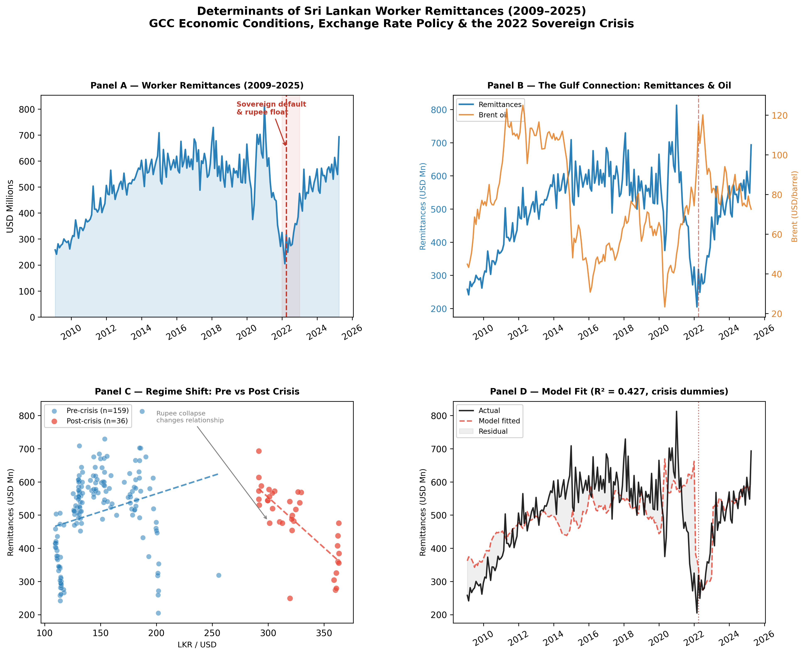
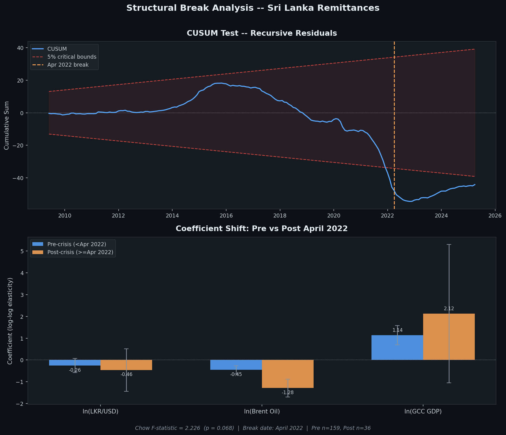
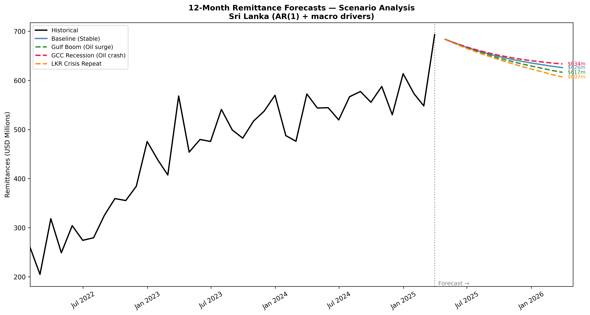

# a barebones Sri Lankan remittance model 
*my first lack-lustre attempt at econometrics*

---

## **what is this?**

Amidst the other jumble of jargon that is thrown around within the field of economics, remittances (more specifically remittance income) are especially significant in the context of Sri Lanka. Where Sri Lankan migrant workers often send sums of money back to the country, usually from the Gulf states. Remittances are one of Sri Lanka’s biggest sources of foreign income, and I kept wondering: does it go up when oil prices rise? (Sort of a stupid thought to have, but fitting given the economic drivers of the Gulf state economies) Or does a weaker rupee make people send more? And finally, what did the 2022 economic collapse actually do to these flows? 

So I “attempted” to build a model. Using the extremely limited coding knowledge I have (and a LOT of ClaudeCode).

This README is me walking through what I found, what confused me and more importantly - what  I think it means in my own understanding. Having studied statistics was simply not enough to fully grasp the brief inclusion of econometrics within this model, so the following explanations should serve as an apt introduction to the variety of concepts that were used. 

---

## the data

All data is pulled from four public sources.

| What | Where from | How often | How far back |
|---|---|---|---|
| Remittances into Sri Lanka | Central Bank of Sri Lanka | Monthly | 2009 |
| LKR/USD exchange rate | Central Bank of Sri Lanka | Monthly | 1986 |
| Brent crude oil price | World Bank Pink Sheet | Monthly | 1960 |
| GCC countries' GDP | IMF World Economic Outlook | Annual | 2009 |

Getting these into one clean dataset was honestly the hardest part, mostly because they arrive in completely different formats. The CBSL files use merged cells, the IMF export is a corrupted binary, and the World Bank dates are formatted like `1960M01`. The cleaning script (`src/02_data_cleaning.py`) handles all of that and produces one tidy CSV: 195 monthly rows from January 2009 to March 2025.

---

## the approach - what is actually going on here?

Before getting into the models, it's worth stepping back and explaining what econometrics actually is and how this whole thing is being approached. Because when I started, I didn't know what half of these words meant either (to be more precise; had no idea what any of these concepts were called officially). 

### what is econometrics?

Econometrics is essentially statistics applied to economic data - specifically, it tries to answer *causal* questions rather than just descriptive ones. Not just "oil prices and remittances both went up in 2021" but "does a 1% rise in oil prices *cause* remittances to increase, and by how much?"

The standard tool for this is **regression**, which finds the mathematical relationship between one variable (what we're trying to explain - here, remittances) and a set of other variables (the things we think explain it - here, oil prices, the exchange rate, and GCC GDP).

### what is OLS?
**OLS stands for Ordinary Least Squares.** It's the most common method for running a regression, and the name describes exactly what it does: it finds the line (or surface, in multiple dimensions) that minimises the sum of squared distances between the actual data points and the line's predictions. "Least squares" = minimise the squared errors.

The output is a set of **coefficients** - one for each predictor variable - which tells you: *holding everything else constant, if X increases by 1 unit, remittances change by β units.* The coefficients are what we're really after.

(This is basically least squares regression in statistics). 

### why log everything?
In economics, it's common to take the natural logarithm of both the outcome variable and the predictors before running the regression. This is called a **log-log model**, and the reason it's useful is that the coefficients become **elasticities** - percentage relationships rather than unit relationships.

So instead of "a $1 rise in oil price increases remittances by $X million", you get "a 1% rise in oil prices increases remittances by β%". That's a much more interpretable and comparable number, and it works regardless of the units or scale of the variables.

### what are dummy variables?
A **dummy variable** is a variable that is either 0 or 1 - it acts like an on/off switch in the regression. Here, I've created a `crisis_period` dummy that equals 1 during the acute 2022 crisis months and 0 everywhere else, and a `post_crisis` dummy that equals 1 for all months after April 2022.

Including these in the regression lets the model account for the fact that the 2022 crisis wasn't just a large fluctuation - it may have permanently shifted the level of remittances up or down, independently of what oil prices and the exchange rate were doing.

### what is a structural break?
A **structural break** is when the underlying relationship between variables fundamentally changes at some point in time. Not just "remittances fell in 2022" but "the *way* remittances respond to oil prices and the exchange rate changed after 2022.

This matters quite a lot. If the relationship changed, then a model estimated on 2009-2025 data is blending two different regimes together - which can produce misleading results. Testing for a structural break means mathematically asking: are the regression coefficients the same before and after April 2022, or did they shift?

### what is an AR(1) model?
**AR(1) stands for Autoregressive lag-1 model.** The idea is simple: instead of only using oil prices, exchange rates, and GDP to predict remittances, we also include *last month's remittances* as a predictor (To be totally honest, it got pretty confusing hereon after). 

This captures the fact that economic series tend to have **momentum** - this month's value is partly just a continuation of last month's. If the AR coefficient is 0.87, it means 87% of last month's level carries forward into this month, before the other variables even come into play. It's often the single most predictive variable in macroeconomic time-series data.

### what is R²?
**R²** (R-squared) is a measure of how well the model fits the data, ranging from 0 to 1. An R² of 0.80 means the model explains 80% of the variation in remittances. The remaining 20% is driven by things not in the model.

Higher is generally better, but a high R² can sometimes be misleading - which is exactly what the spurious regression problem below is about.

(This is the "correlation co-efficient" in A-Level statistics)

### what is the Durbin-Watson statistic?
**Durbin-Watson (DW)** is a diagnostic test for autocorrelation - whether the model's errors are correlated with each other across time. In a well-specified model, the errors should be random: if the model over-predicted this month, that should have no bearing on whether it over-predicts next month, logically speaking. 

A DW value near **2** means no autocorrelation (which is good). A value near **0** means strong positive autocorrelation (which is bad) - the errors are trending in the same direction across time, which is usually a sign that something is seriously wrong with the model itself. 

---

## what I'm testing

The core question that I'm asking here is: **what predicts remittances?**

I used three “candidate” predictors:
1. **LKR/USD exchange rate**, where if the rupee weakens, each dollar sent home is worth more LKR, which should theoretically encourage sending more
2. **Brent crude oil price**, which I used as a proxy for how well the Gulf economy is doing; mostly because the GCC states run on oil revenue which then funds everything else 
3. **GCC GDP**, which was a more direct measure of the Gulf economic output

I ran four different models, each asking a slightly varied version of the question. 

---



---

## the models

### model 1 - the basic one, log-log OLS, R² = 0.285

This was my starting point. Taking the log of everything and running a standard OLS regression. As explained above, the coefficients should come out as elasticities - intuitive and easy to interpret.

The function threw out signs that were seemingly backwards. Higher oil prices apparently *reduce* remittances? A weaker rupee *reduces* remittances? That makes no sense economically (At least with conventional A-Level economics). 

So what's happening here? he Durbin-Watson statistic comes back at 0.40 - near zero, which is a big red flag. All three predictor variables trend upward over 2009–2025, and OLS is picking up those shared trends rather than real causal relationships. Oil happened to be low in 2015–2016, and remittances happened to be high then - so the model "concludes" oil hurts remittances. That's coincidence being mistaken for causation: **spurious regression**.

Finding this out (after wondering why the hell the statistics didn’t quite match up) felt pretty cool, because I had to use a mathematical statistic to judge whether or not the findings were a causation or a coincidence (A trap that is so ubiquitous with statistics). The R² of 0.285 with a DW of 0.40 is basically the textbook example of spurious regression. Spotting it out was the whole point, because we can't just naively trust mathematical models blindly. 

One coefficient survived with a sensible sign: **GCC GDP (+1.43\*\*\*)** - reveals that higher Gulf economic output is strongly associated with more remittances. That one holds up in every model going forward.

---

### model 2 - adding the crisis, R² = 0.427, <- *the main one*

The 2022 Sri Lanka crisis - sovereign default, rupee collapse from ~200 to ~370 per dollar almost overnight — is the most dramatic event in the sample. So I added two dummy variables: one of the acute crisis months (in 2022) and one for the permanent post-crisis period after. 

**R² jumps from 0.285 to 0.427.** That 14 percentage point jump from just two variables revealed a major thing: the crisis was a *structural* event that changed the level and behaviour of remittances, and was not just a big swing. 

The two coefficients, thereby, are explained below;

**crisis_period = −0.52\*\*\*** -> during the acute crisis months, remittances were about 40% lower than the macro fundamentals would predict. The banking system was breaking down in real time: informal transfer channels were overwhelmed, restrictions on USD transfers were imposed, and general financial chaos suppressed flows that families urgently needed.

**post_crisis = −0.20\*** -> after the crisis stabilised, remittances settled at a level about 18% below the pre-crisis trend. A permanent downward shift it seemed. Some workers came home and didn't go back. Some Gulf employers stopped hiring entirely. The relationship between fundamentals and remittances changed.

Something else that was interesting to note: once the crisis dummies were added, the exchange rate coefficient completely lost significance (p = 0.865). The "exchange rate effect" in model 1 was mostly just the crisis in disguise - the rupee crashed during the crisis, so the two variables were confounded until the crisis was explicitly being controlled for.

---

### model 3 - growth rates, R² = 0.059

Instead of log levels, I used year-on-year growth rates here. This strips out the trending behaviour and asks: do month-to-month swings in oil prices predict month-to-month swings in remittances? (Again, a pretty stupid question to ask, but necessary nonetheless). 

And the answer? Barely -> R² = 0.059. Oil growth is statistically significant but the relationship is weak once the trend is removed. The DW was 0.29 which is still alarming - even in growth rates, there’s an autocorrelation. That means remittances have strong momentum; where the last month matters a lot. Which is what model 4 is built for.

---

### model 4 - AR(1) with last month as a predictor, R² = 0.799

I added last month’s remittances as an extra predictor. . The AR coefficient comes out at **0.873\*\*\*** - meaning that 87% of last month's level carries into this month before oil prices or the exchange rate even come into play.

The DW improves to 2.62, which is pretty clean. And the R² hits 0.799. The trade-off though: once the lag is included, oil price and exchange rate lose significance because the lag absorbs their signal. This doesn't mean they're irrelevant; it means their effect plays out over several months rather than instantaneously.

This was what I used as the base for the forecasts below.

---

## the structural break test



### what is the Chow test?

The **Chow test** is a formal statistical test for a structural break. It works by running three separate regressions: one on the full sample, one on the pre-break sub-sample, and one on the post-break sub-sample. It then asks: does allowing two separate regressions fit the data significantly better than forcing one single regression? If yes - the break is real, and the coefficients genuinely changed.

The test produces an **F-statistic** and a p-value. A small p-value means we can confidently reject the null hypothesis that the coefficients are the same before and after the break date.

**Chow test at April 2022: F = 2.23, p = 0.068** - significant at 10%, borderline at 5%.

On its own, that sounds weak. But look at what happens when the sample is split and separate regressions are run:

| Period | N | R² |
|---|---|---|
| Pre-crisis (Jan 2009 – Mar 2022) | 159 | 0.228 |
| Post-crisis (Apr 2022 – Mar 2025) | 36 | **0.798** |

The model explains 23% of variance pre-crisis and 80% post-crisis. That's a massive regime shift - and the Chow test's borderline p-value is partly a statistical power problem: 36 post-crisis observations is a very small sample, which limits how decisive the test can be. The R² difference is arguably more telling than the p-value here.

What's my intepretation of this? Before 2022, remittances were partly driven by seasonal cycles, informal hawala transfer channels, and things not in this model. After 2022, workers appear to have shifted towards formal banking channels to capture the weaker rupee - making flows much more responsive to macro variables.

The Brent oil elasticity also shifted: from −0.45 pre-crisis to −1.28 post-crisis (interaction term significant at 5%). Gulf workers became more financially exposed to oil price swings after the crisis - possibly because remittance pressure from families increased during the recovery period.

### what is the CUSUM test?

**CUSUM stands for Cumulative Sum of Recursive Residuals.** Essentially a visual complement to the Chow test. Here's how it works: the model is estimated recursively - first on just the earliest observations, then with one month added at a time, all the way to the end of the sample. At each step, the "surprise" (how wrong the model was) is recorded. CUSUM is the running total of those surprises.

If the model's underlying relationships are stable throughout the sample, the surprises should roughly cancel out and the CUSUM line should hover near zero. If the relationships change at some point, the surprises start going consistently in one direction - and the CUSUM line drifts, eventually crossing the red confidence bounds on the chart.

**The CUSUM exits the 5% confidence band around 2022** - exactly where you'd expect given everything else. This is a second, independent confirmation of parameter instability at the crisis point.

---

## scenario forecasts (12 months from April 2025)



Using the AR(1) model, four possible macro futures are simulated:

**Baseline** -> oil flat around $75, LKR stable, GCC modest growth.
Remittances continue their post-crisis recovery trajectory.

**Gulf Boom** -> oil rises ~27% over 12 months, strong GCC expansion.
Best case for remittances; Gulf hiring picks up and workers send more.

**GCC Recession** -> oil falls ~35%, GCC GDP contracts.
Significant downside; the oil-remittance link means a Gulf slowdown hits Sri Lankan households directly.

**LKR Crisis Repeat** -> rupee depreciates ~35% again.
Mixed outcome: more LKR per dollar sent could encourage transfers, but a currency collapse also signals economic instability that historically suppresses formal flows.

(It's pretty important for me to note that these are scenario simulations, not point predictions. The point is to illustrate how sensitive remittances are to different macro environments, and not necessarily just to forecast a specific number).

---

## final summary of findings

**1. GCC economic output is the dominant driver.**
The GCC GDP elasticity (+1.14) is the most stable coefficient across every specification. The Gulf economy (not the exchange rate) is the primary determinant of how much workers send home.

**2. The 2022 crisis was structural, not just a large swing.**
Model fit triples when the sample is split at April 2022. The crisis changed how remittances respond to fundamentals, and not just the levels going forward. 

**3. The oil price elasticity doubled post-crisis.**
The relationship between oil prices and remittances became significantly stronger after 2022. Gulf workers appear more financially exposed to commodity cycles in the post-crisis period.

**4. Remittances are highly persistent.**
AR coefficient of 0.87 which shocks decay over roughly 5-6 months. "Last month" is the single best predictor of this month basically. 

**5. Spurious regression is real and easy to stumble into.**
The naive OLS produced backwards signs. Recognising and diagnosing this (using the Durbin-Watson statistic) was the most important methodological step in the whole project - without which, a lot of the modelling would've been misleading. 

---

## final thoughts

This project took a bit longer than I expected, and I definitely made alot of mistakes along the way. The data cleaning alone probably took more time than all four models combined, which apparently is a very normal experience in data science and not really something that the internet warns you about. 

A few honest limitations worth flagging (as with any "scientific" inquiry with data and math);

**The post-crisis sample is very tiny.** 36 months is not a lot to work with. The Chow test being borderline (with a p = 0.068 rather than 0.05) is partly just a reflection of that - the test doesn't have enough observations to be definitively decisive. A longer post-crisis window would strengthen every finding here. 

**The GCC gross domestic product variable is constructed.** I couldn't get the IMF file to open (like it was genuinely corrupted I think), so I had to manually enter all known annual GDP values for the six GCC countries and interpolated them to monthly. It's reasonable, but it's not really the same as having real monthly data. A better proxy might be GCC PMI data or Gulf stock market indices, which actually move month month - but I think that's just too convoluted for building a model for the first time. 

**The exchange rate story is incomplete.** The LKR/USD rate loses significance once you control for the crisis, which probably means that the rupee's effect on remittances is more complicated than a simple linear relationship. There's likely a threshold effect, where moderate depreciation encourages remittances, but a full currency collapse suppresses them through panic and banking dysfunction. Modelling that properly would require a nonlinear model that I didn't want to attempt just now (Yet?). 

**Spurious regression is managed but not fully solved.** The AR(1) model helps and the growth-rate model strips out the trend, but a more rigorous treatment would handle something called formal root tests (the Augmented Dickey-Fuller test) and potentially a cointegration framework (??) if the variables share a long-run equilibrium. Concepts I found out while researching, that I wasn't too inclined to introduce into this project. 

**on using Claude to build this,**

I'll be straightforward about this. I used Claude like, extensively throughout this project. Every script in 'src/' was written with its assistance, mostly because I had very limited Python and datascraping experience prior. 

While I would usually agree that using AI to build something up *completely* is a very unproductive and reductive thing to do (looking at you specifically; all the slop AI LinkedIn posts and web projects), I don't think that would apply here in this project. The code (which was what the AI was used for here) was never the point of this. What I was actually trying to do was understand whether econometric models could tell me something about a genuine question that I had. The AI handled all the syntax (and occasionally broke down the principles), but I had to understand what I was asking it to do, why each model was structured the way it was, what the output meant and like whether the findings made economic sense. When the results came backwards due to spurious regression (which I didn't know of while I was making this), I had to recognize that something was wrong and know what to look for. And tadaa, it was the Durbin-Watson statistic, the spurious regression problem itself and the entire logic of splitting the sample up.

If the question is whether I learned anything: yes! I now know why log transformations matter, what a structural break test is checking for, and whay a DW of 0.40 should make anyone suspicious. I couldn've have told you any of that before I started this entire project. That, at least in my humble opinion, feels like the right outcome for a first attempt at anything:)

---

## how to run this yourself

```bash
git clone https://github.com/va5ca1/remittance-model_lk
cd remittance-model_lk
pip install -r requirements.txt

python src/02_data_cleaning.py
python src/03_exploratory_analysis.py
python src/04_model_estimation.py
python src/05_chow_test.py
python src/06_forecast_simulation.py
python src/07_final_dashboard.py
```

---

## project structure

```
sl-remittance-model/
├── data/
│   ├── raw/                        # Source files (CBSL, World Bank, IMF)
│   └── processed/
│       └── merged_dataset.csv      # 195 rows, Jan 2009–Mar 2025
├── src/
│   ├── 02_data_cleaning.py
│   ├── 03_exploratory_analysis.py
│   ├── 04_model_estimation.py
│   ├── 05_chow_test.py
│   ├── 06_forecast_simulation.py
│   └── 07_final_dashboard.py
├── outputs/
│   ├── figures/                    # All charts (PNG)
│   └── tables/                     # Regression results and forecasts
└── README.md
```

---
